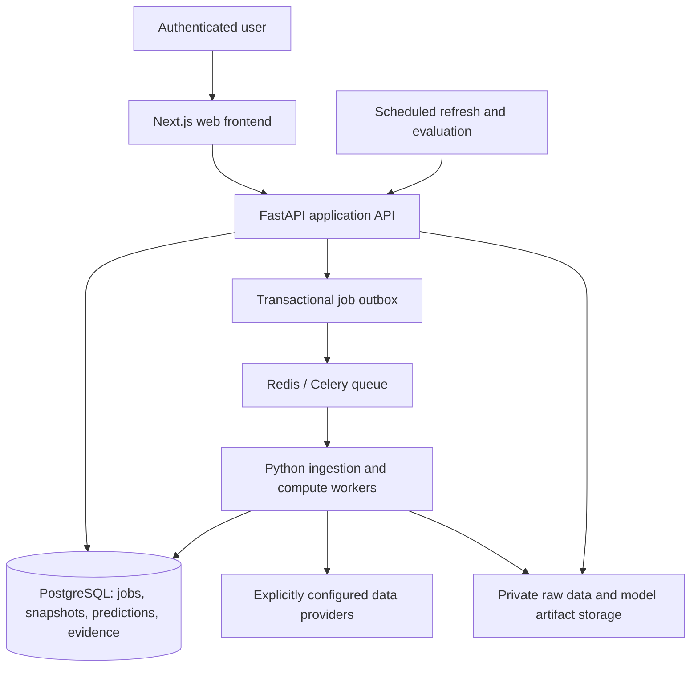

# Proposed frontend/backend architecture and migration

Status: recommendation, not implemented. Date: 2026-09-20. Companion: [prioritized project audit](audit-2026-09-20.md).

## Recommendation

Operational and product refinements are recorded in [IMP01–IMP12](improvements-2026-09-20.md): secret-safe packaging/logging, transactional cache publication, validated configuration, restore drills, CLI outcomes, quotas, monitoring, experiments, explanations, and measured optimization. Incorporate their acceptance requirements into the relevant migration stages; they are not implemented features.

The [UI/UX audit](ui-ux-audit-2026-09-20.md) supplies the detailed frontend acceptance requirements for this migration: 12 prioritized findings, run-state clarity, onboarding, navigation, result entry, and outstanding rendered accessibility checks. Track implementation in the [shared backlog](../tasks/todo.md); none is implemented by these documents.

Build a separate TypeScript/Next.js frontend, a Python/FastAPI modular backend, and isolated Python compute workers. Keep Supabase-managed PostgreSQL as the authoritative store, with explicit migrations, constrained roles, and authenticated access. Use Celery with Redis for queued compute; store job/result truth in PostgreSQL, not solely in the queue. Store immutable raw snapshots and model artifacts in private object storage. Do not rewrite numerical logic in JavaScript or split every Python module into an independently deployed service.

This choice preserves the existing Python investment and separates interactive requests from expensive fitting. Next.js supports server-rendered data views and interactive client components; use that split for results versus filters/charts. [Next.js component guidance](https://nextjs.org/docs/app/getting-started/server-and-client-components). FastAPI itself points to a separate worker system such as Celery for heavy computation rather than in-process background tasks. [FastAPI background-task guidance](https://fastapi.tiangolo.com/tutorial/background-tasks/).

Correct the engine and data defects before migrating screens. A new frontend must not make the current recommendations appear production-ready.

## Current architecture and its limits

Streamlit currently contains both presentation and workflow orchestration. A button synchronously loads providers, fits a model, fetches fixtures, scores, writes two stores, and updates process/session state. Other screens depend on that state or read a local file. CLI and UI have different persistence behavior; simple backtest and gate harness have different model/data semantics. There is no shared approval/publishing boundary. CPU cost, network failure, data provenance, session lifetime, and persistence are coupled to page interactions.

Useful existing boundaries: `src/models`, `src/analytics`, and much of `src/validation` are mostly independent of Streamlit; provider adapters are already grouped; a remote database schema exists. Reuse corrected domain logic and representative tests, not existing fallback assumptions.

## Target deployment and responsibilities

| Component | Owns | Must not do |
|---|---|---|
| Web frontend | Matchday, diagnostics, evaluation, ledger, progress and unavailable states | Compute probabilities/EV/Kelly, hold provider secrets, fabricate missing values |
| API/application layer | Authentication, authorization, schema validation, run creation, idempotency, publication policy, reads and exports | Fit models inside HTTP requests or silently substitute providers/models |
| Domain engine | League-scoped training, inference, market comparison, optional position sizing, scoring and evidence rules | Import Streamlit, read environment secrets, or write storage directly |
| Provider adapters | Fetch and validate a declared source, retain timestamps/IDs and raw provenance | Generate sample observations or choose another provider on failure |
| Worker layer | Execute versioned jobs, report progress, enforce resource limits, persist outcomes | Treat a queue acknowledgment as a committed result |
| PostgreSQL | Durable workflow state, entities, predictions, approvals, positions if supported, append-only result events | Depend on a local Parquet ledger for recovery |
| Private object storage | Content-addressed raw snapshots, evaluation reports, immutable model artifacts | Accept executable artifacts from users or expose provider payloads publicly |

Use one repository with deployable `web`, `api`, and `worker` applications and a shared Python domain package. Keep provider/storage adapters outside numerical modules. Generate the frontend API types from OpenAPI to avoid separate manually maintained response definitions. Pin exact dependencies and include their lock/build identity in artifacts during implementation; this proposal does not select unverified version numbers.

## Data and trust contracts

### Identity and snapshots

Create internal competition, team, season, and fixture IDs. Map provider IDs explicitly; aliases are versioned reference data, not identities generated from three-character slugs. Fixture revisions handle postponements without rewriting historical predictions. One league model cannot accept another league's fixture.

Persist immutable dataset snapshots with provider, retrieval time, source update time when available, event-time semantics, raw content hash, coverage, validation exclusions, schema version, and `origin=observed`. Training requires an approved real-data snapshot. Keep date-only historical observations distinct from actual UTC kickoff times; do not invent time precision.

Keep each bookmaker's complete 1X2 quote with fixture ID, bookmaker ID, quote time, ingestion time, prices, and source snapshot ID. The consensus estimator is a separately versioned analytical view. EV references a specific available quote, not an untradeable average. A required source or price leg being absent yields an exclusion, not an automatic alternative source.

### Models and predictions

Model artifact identity includes league, exact dataset hash, UTC training cutoff, training-window specification, goal versus xG target, parameter configuration hash, build/dependency identity, optimizer diagnostics, probability-domain checks, and grid-tail policy. Use one immutable artifact ID everywhere. A failed optimizer does not create an eligible model artifact. A previous artifact may be inspected as historical output, but must not be silently substituted for a failed requested retrain.

A prediction references fixture revision, model artifact, input snapshots, quote ID when applicable, forecast time, three-way probabilities, scoreline distribution metadata, expected goals, and validation/eligibility state. Separate:

- `forecast_status`: ready or unavailable, with reason codes.
- `market_analysis_status`: ready or unavailable; real model probabilities can exist without a market quote if a forecast-only request was explicitly made.
- `recommendation_status`: eligible or blocked, linked to the exact approved evidence report and policy version.

Unavailable values are null/absent with a reason, never invented numbers. Do not replace a requested market-analysis run with a forecast-only run after a provider failure. Normal probability normalization is permitted only for a mathematically valid distribution with a verified truncation bound; it cannot repair negative/nonfinite cells.

### Authoritative records

Recommended table groups:

- Reference: competitions, teams, provider-team mappings, fixtures and fixture revisions.
- Evidence: source snapshots, dataset snapshots, odds quotes, model artifacts, evaluation runs/reports, release approvals.
- Workflow: jobs, run requests, idempotency keys, transactional outbox, structured failure events.
- Outputs: immutable prediction runs and predictions, result/settlement events, audit events.
- Optional positions: portfolios, explicit executions, exposure reservations, position settlements. These are not inferred from predictions.

Use foreign keys, finite/range checks, unique run/fixture/quote identities, and transactional publication. Forecast probabilities must be finite and sum to one within the declared tolerance. Recommendation publication requires a valid model, current observed inputs, a specific quote, release approval, and a committed audit record. Store sizing/qualification and their policy version if those capabilities remain enabled.

Production users may read published results under an explicit access policy. Only trusted workers create predictions; authorized operators or verified ingestion create result events. Anonymous users cannot insert evidence. Revoke the existing broad policies as a controlled migration after integration tests. Grants and RLS must both be configured; RLS alone is not authentication or protection against forged append-only rows. [Supabase RLS guidance](https://supabase.com/docs/guides/database/postgres/row-level-security).

## API and job behavior

Use versioned `/api/v1` JSON endpoints. One authentication scheme (Supabase Auth JWTs verified by the backend), role-based operator actions, and owner checks for private runs/portfolios. Keep provider and database writer secrets only in API/worker runtime configuration.

| Interface | Contract |
|---|---|
| `GET /fixtures` | Filtered current fixtures with source, timestamps, completeness, and freshness status |
| `POST /prediction-runs` | Explicit league/fixtures, source policy, model specification, request type and idempotency key; returns 202 with run/job ID |
| `GET /jobs/{id}` | queued/running/succeeded/failed/cancelled, progress, structured reason and timestamps |
| `GET /prediction-runs/{id}` | Immutable input specification, model/data identities, publish status, results and exclusions |
| `GET /models/{id}/diagnostics` | Parameters, coverage, optimizer status, retained mass and evidence identity |
| `POST /evaluation-runs` | Operator-only versioned chronological evaluation on declared snapshot, tuning window and held-out window |
| `GET /evaluation-runs/{id}` | Metrics, market comparisons, CLV contrast intervals, exclusions, report and gate status |
| `GET /ledger` | Paginated authoritative run/prediction/result history; scoped CSV export |
| `POST /settlement-events` | Authorized, idempotent event linked to fixture/result evidence; settle actual positions individually if present |
| `GET /health/live`, `GET /health/ready` | Process liveness versus service readiness; no secrets |

Validate requests before queueing. Duplicate idempotency keys with identical request bodies return the existing run; conflicting bodies return 409. Schema errors return 422, authorization failures 401/403, and inability to accept a durable job 503. Once accepted, execution failures are recorded against the job and displayed by the frontend. Poll status while running; introduce server-sent events only if polling proves inadequate. Do not require WebSockets for initial delivery.

Write the job and outbox record in one transaction. A dispatcher submits jobs; worker delivery can repeat, so completion must be idempotent. Use worker leases/heartbeats to recover interrupted jobs, bounded same-provider retries for transient errors, timeouts, and explicit terminal failure. Never retry by changing source/model/price policy. Keep model/evaluation jobs in a resource-limited process queue separate from short ingestion tasks. Enforce bounded concurrency and one active identical training specification.

An unavailable provider must not prevent the app from opening or viewing historical records. It must prevent a new dependent run from publishing. Database failure must prevent publication, not trigger a local-file replacement. Queue failure leaves the transactionally recorded job pending with a visible state; it must not execute heavy work in the HTTP handler as a workaround.

## Evaluation and recommendation policy

Use the same league-scoped fit/inference service for live runs and replay. Predictions at cutoff T see only observations available strictly before T. Historical match date alone does not establish when a vendor correction became available: record this limitation for legacy archives and retain observed-at metadata going forward.

Tune decay and any badge/decision thresholds only inside training/validation periods. Freeze them before final chronological holdout; do not repeatedly tune against the deployment gate. Report draw and three-way proper scores against the declared market baseline, calibration, exclusions/coverage, same-policy two-price CLV, and uncertainty with joint week-block resampling. Keep the main gate's flagged-minus-baseline statistic aligned within each bootstrap replicate. Correct for selection across leagues/configurations or reserve an untouched confirmation period before approval.

No universal threshold or 11-bet sample establishes readiness. Set a preregistered evaluation policy for required independent weeks, uncertainty width, coverage, quote freshness and source completeness based on provider cadence and intended use, then record it as a versioned approval dependency. Those empirical thresholds require real-data evaluation; they are not fabricated here. Until that policy and supporting evidence exist, recommendation status remains blocked. Forecast-only research views may show valid outputs with their limitations.

Default product scope for migration is forecasting and transparent evaluation, without automated bet placement. Existing Kelly outputs remain research-only until portfolio accounting and release policy are implemented. Automatic betting, alert channels, and additional providers are separate future work.

## Migration order and acceptance gates

Each stage is expanded into an open task specification: [M01 domain engine](../tasks/detailed-backlog.md#m01), [M02 evaluation/approval](../tasks/detailed-backlog.md#m02), [M03 API/workers/storage](../tasks/detailed-backlog.md#m03), [M04 frontend](../tasks/detailed-backlog.md#m04), [M05 shadow/readiness](../tasks/detailed-backlog.md#m05), and [M06 cutover/rollback](../tasks/detailed-backlog.md#m06). Use their dependencies and evidence requirements alongside this architecture proposal. [Shared release gates](../tasks/detailed-backlog.md#release-level-gates) distinguish documentation, implementation verification, empirical approval and authorized deployment.

| Stage | Work | Exit condition |
|---|---|---|
| 1. Correctness foundation | A01–A05, identity/domain schemas, strict provider policy, fixture freshness, probability validity | Asymmetric tau, unknown-team, model-failure and synthetic-source regression cases pass; no replacement production predictions |
| 2. Unified engine and evidence | Align live/backtest behavior, real two-price data assembly, reproducible artifacts/cache, baseline gate, correct metrics | Real archival input reaches the harness; identical snapshots replay identically; bad evidence cannot approve a release |
| 3. Durable backend | Database migrations, auth/roles, authoritative transactions, immutable events, API and queue/outbox | Unauthorized writes fail; retry/restart/concurrency tests preserve exactly one logical result; persistence failure blocks publication |
| 4. Frontend parity | Matchday, diagnostics, evaluation and ledger against API; explicit empty/failure/stale states | Browser/API contract tests cover valid, incomplete, failed and unauthorized flows; no frontend analytics or sample fallback |
| 5. Shadow validation | Run new system against traceable real snapshots and compare outputs; review intended differences from corrected maths | All unexplained differences resolved, evidence approved for exact version, operating policy documented |
| 6. Controlled cutover | Switch UI traffic, freeze Streamlit writes, archive legacy data and retain exports | One writer path and one authoritative ledger; health, queue lag, data age and publication failures visible |

Import legacy local and remote records into a preserved legacy namespace first. Identify duplicate fixture/run records without assuming each is a real position. Missing source/version/season metadata remains unknown. Do not backfill provenance, trades, or settlements by guessing. Existing unverified outputs cannot acquire a production approval merely through import.

Keep Streamlit only as an internal read-only diagnostic client after API parity. Do not dual-write from old and new UIs. Rollback may restore a previous verified application build compatible with the database, but must not reactivate synthetic feeds or fallback recommendations. On model/data regression, block recommendations and retain readable historical outputs.

## Operations and tests required

Structured logs carry job/run IDs, source snapshot IDs, build/model version and reason codes, excluding keys and raw secrets. Track provider coverage/freshness, rejected rows, identity misses, fit failures, probability violations, queue age, job duration, database commits, and blocked publications. Define operational thresholds from observed workloads and provider agreements before cutover. Deployment health checks cannot substitute for valid data/model approval.

Required tests: mathematical invariants before normalization; real schema parsing; provider outage and rate limits; malformed/expired odds; unknown identities; strict no-substitution imports; authorization and SQL constraints; worker restart/idempotency; concurrent runs and exposure reservations; per-position settlement; artifact invalidation; temporal replay; source-age boundaries; and UI handling of null/unavailable values. Use synthetic fixtures only in isolated tests. Benchmark full-corpus cost after correctness work, then scale worker concurrency from measured CPU/memory requirements.

This is an architecture recommendation, not a delivery estimate or a claim of production readiness. Hosting region, provider entitlements, budget, workload sizing, retention policy, and empirical approval thresholds remain deployment decisions to settle with real operational requirements. None requires changing application code during this audit.
